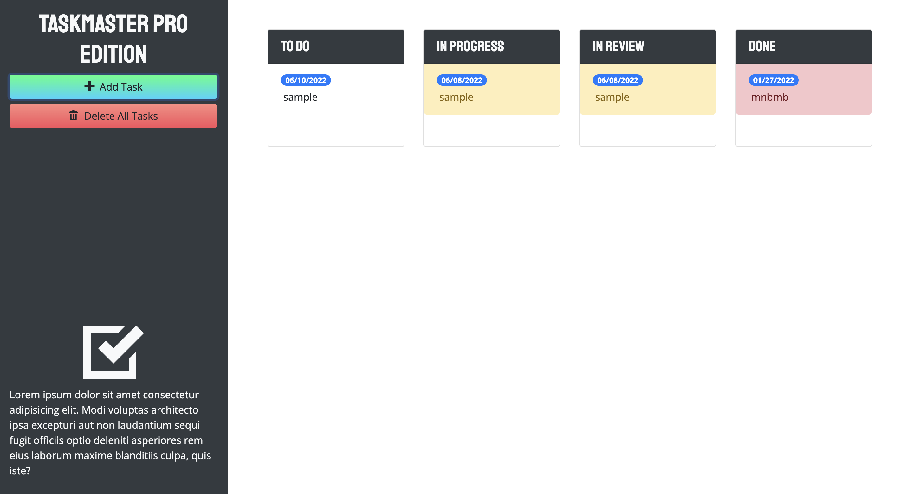

<h1 align="center">Taskmaster Pro<h1>

## Description
As an introduction to third-party APIs and the process of working with legacy code, the purpose of this project was to update a task-management application called Taskmaster. This Taskmaster Pro Edition features an updated layout, the ability to edit tasks, drag-and-drop capabilty, due date handling with an interactive calendar datepicker, and improved UI.

## Table of Contents
* [Installation](#installation)
* [Usage](#usage)
* [License](#license)
* [Contributing](#contributing)
* [Tests](#tests)
* [Questions](#questions)

### Overview of Concepts Learned
* How to speed up development using third party APIs
* The difference between jQuery and JavaScript
* Introduction to Bootstrap
* How to customize CSS frameworks
* How to implement libraries and frameworks
* DOM traversals and manipulations with jQuery
* How to use fonts and icons via CDNs

### Built With
* HTML
* CSS
* JavaScript
* Bootstrap
* jQuery
* Moment.js

## Installation 
Users should clone the repository from GitHub and open the index file in the browser.

## Usage 
This application allows users to search for any user on GitHub and view their open source projects. 
Please view deployed on [GitHub Pages](https://goodwinamundson.github.io/git-it-done/)
 

## License 
This project is licensed under MIT

## Contributing 
Contributors should read the installation section. 

## Tests
There are no tests for this application. 

## Questions
If you have any questions about this projects, please contact me directly at goodwinamundson@gmail.com. You can view more of my projects at https://github.com/goodwinamundson.
